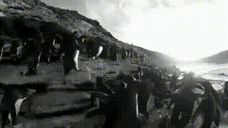
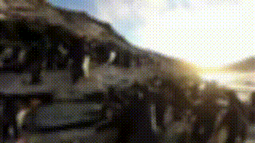

# Video-Editor

A lightweight Python-based video editing tool using OpenCV and NumPy. This program provides a simple interface for applying basic video effects, trimming, and exporting videos. Designed with a builder pattern, the VideoEditor class allows for seamless method chaining, making video editing straightforward and intuitive.

[2 Minute Quick Showcase in Terminal](https://youtu.be/qym4_PWdxm8)

[Previews of all the effects](#chainable-editing-methods)

## Features

- Chainable methods for clean, expressive editing pipelines.

- Modular effects system for better maintainability.

- Support for multiple effects, including:

    - Grayscale, chromakey, blur, zoom, and rotate.

    - Fun effects like shaky cam, glitch, scan lines, and snow.

- Trim videos by cutting specific sections.

- Add images or overlays to videos.

- Optimize video size by removing similar consecutive frames.

- Real-time preview during rendering.

- Compatible with MP4 output format.

## Installation

**Clone the repository**:

    git clone https://github.com/SamuelSoNChino/Video-Editor.git
    cd Video-Editor

**Install dependencies**:

    pip install numpy opencv-python

## Example Pipelines

Using the builder pattern:

    from video_editor import VideoEditor
    VideoEditor() \
        .add_video("video1.mp4") \
        .add_video("video2.mp4") \
        .grayscale(0, 5) \
        .chromakey(5, 10, "background.png", (0, 255, 0), 50) \
        .shaky_cam(10, 15) \
        .blur(15, 20, intensity=10) \
        .render("final_output.mp4", width=1280, height=720, framerate=30)

Or using methods individually in Python interpreter:

    >>> from video_editor import VideoEditor
    >>> ve = VideoEditor()
    >>> ve.add_video("video1.mp4")
    >>> ve.add_video("video2.mp4")
    >>> ve.grayscale(0, 5)
    >>> ve.chromakey(5, 10, "background.png", (0, 255, 0), 50)
    >>> ve.shaky_cam(10, 15)
    >>> ve.blur(15, 20, intensity=10)
    >>> ve.render("final_output.mp4", width=1280, height=720, framerate=30)

## Chainable Editing Methods

- `add_video(path: str)`

    Adds a video to the editing pipeline.

- `cut(start: float, end: float)`

    Trims a specific section of the video (in seconds).

- `render(path: str, width: int, height: int, framerate: float, short: bool = False, show_preview: bool = True)`

    Exports the final video to the specified path.

    **Parameters**:

    `short`: Removes similar frames to reduce file size.

    `show_preview`: Enables frame preview during video rendering. (Hold Q key for fast-forward)

- `grayscale(start: float, end: float)`

    Converts frames to grayscale within the specified time range.  
    
    **Preview:**
    
    

- `chromakey(start: float, end: float, img: str, color: Tuple[int, int, int], similarity: int)`

    Replaces a specific color in the video with a given image.

    **Parameters**:

    `img`: Path to the replacement image.  

    `color`: RGB tuple of the color to filter.  

    `similarity`: Threshold for color matching.  
      
    
    **Preview:**
    
    

- `shaky_cam(start: float, end: float)`
    
    Adds a "shaky camera" effect to simulate motion.  
      
    
    **Preview:**
    
    

- `zoom(start: float, end: float, pos: Tuple[float, float, float, float])`

    Zooms into a specific area of the frame.

    Parameters:

    `pos`: Tuple representing (x_start, y_start, x_end, y_end) as percentages.    
      
    
    **Preview:**
    
    

- `image(start: float, end: float, img: str, pos: Tuple[float, float, float, float])`

    Overlays an image on the video at a specific position.  

    **Parameters**:

    `pos`: Tuple representing (x_start, y_start, x_end, y_end) as percentages.  
      
    
    **Preview:**
    
      

- `flip(start: float, end: float, axis: Literal[0, 1, -1])`

    Flips the video:

    `0`: Vertically  

    `1`: Horizontally  

    `-1`: Both    
      
    
    **Preview:**
    
    

- `rotate(start: float, end: float, rotation: int)`

    Rotates the video by a specified angle (in degrees).  
      
    
    **Preview:**
    
    

- `blur(start: float, end: float, intensity: int)`

    Blurs frames within the given time range (recommended intensity: 1–50)    
      
    
    **Preview:**
    
    

- `glitch(start: float, end: float)`
    
    Adds a random glitch effect.  
      
    
    **Preview:**
    
    

- `scan_lines(start: float, end: float)`

    Adds scan lines to create a retro effect.  
      
    
    **Preview:**
    
    

- `snow(start: float, end: float)`

    Simulates snow-like static noise.  
      
    
    **Preview:**
    
    

## Implementation Details

### 1. `video_editor.py`:
- **Purpose**: A modular video editor that supports cutting, resizing, and applying multiple visual effects to videos.

- **Technologies Used**:

    - **OpenCV**: Handles video frame processing, resizing, and rendering effects.
    
    - **NumPy**: Efficiently manages frame data and optimizations.
    
    - **Custom Effect Modules**: Provides a range of visual effects.

- **Key Features**:

    - Loads multiple video files for sequential editing.
    
    - Supports cutting specific time segments.
    
    - Applies effects.
    
    - Resizes frames to a specified width and height.
    
    - Writes processed frames to an output video file.
    
    - Optimizes rendering by skipping similar frames if `short=True`.
    
    - Includes an optional real-time preview of the processed video

### 2. `Effect.py`:

- **Purpose**: Provides a framework for applying various visual effects to video frames during processing.

- **Technologies Used**:

    - **OpenCV**: Performs image transformations, including color manipulation, blurring, rotation, and glitch effects.
    
    - **NumPy**: Handles efficient pixel manipulation and matrix operations for effect processing.
    
    - **Random Module**: Introduces randomness in effects such as shaky cam, glitch, and scan lines.

- **Key Features**:

    - Effect base class defines a standard interface for all effects.
    
    - EffectRenderer applies a queue of effects to video frames dynamically.
    
    - Supports multiple visual effects, including grayscale, chromakey, shaky cam, zoom, flip, rotation, blur, glitch, scan lines, and snow.
    
    - Applies effects only within specified time intervals.
    Optimized for real-time frame-by-frame processing.

### 3. `utilites.py`:

- **Purpose**: Compares two video frames to determine their similarity based on pixel differences.

- **Technologies Used**:

    - **NumPy**: Performs efficient pixel-wise comparison and calculates the total difference.

- **Key Features:**

    - Returns a boolean indicating if frames are similar based on a threshold.
    
    - Efficient for real-time video processing.
